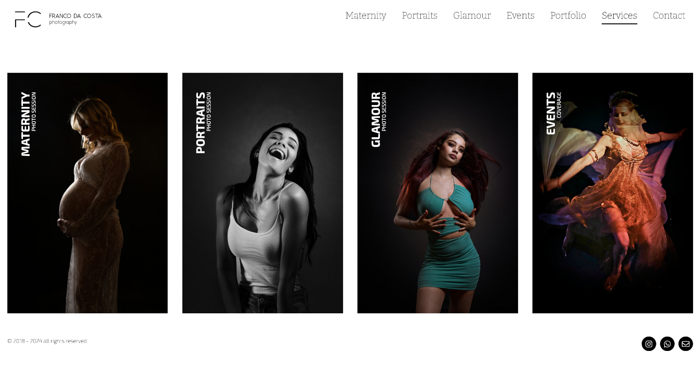

# Foo Theme



**Foo** is a Photography Centric Theme  for [Grav CMS](http://github.com/getgrav/grav).  This theme is built with Bootstrap 5.3

## Features

* Modular Page design
* Porfolio (photo dump) page
* Navigation using Images
* Fully responsive with full-page mobile navigation
* SCSS based CSS source files for easy customization
* Multiple page template types
* Fontawesome icon support

# Installation

Installing the theme can be done in one of two ways. Our GPM (Grav Package Manager) installation method enables you to quickly and easily install the theme with a simple terminal command, while the manual method enables you to do so via a zip file.


## GPM Installation (Preferred)

The simplest way to install this theme is via the [Grav Package Manager (GPM)](http://learn.getgrav.org/advanced/grav-gpm)

```
    bin/gpm install foo
```

This will install the Quark theme into your `/user/themes` directory within Grav. Its files can be found under `/your/site/grav/user/themes/foo`.


